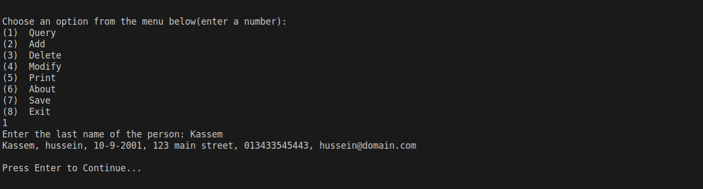

# Phone Book App

## Contents:

- [Phone Book App](#phone-book-app)
  - [Contents:](#contents)
  - [User Guide](#user-guide)
    - [Starting the program](#starting-the-program)
    - [Navigation](#navigation)
    - [Query](#query)
    - [Add](#add)
    - [Delete](#delete)
    - [Modify](#modify)
    - [Print](#print)
    - [About](#about)
    - [Save](#save)
    - [Quit](#quit)
  - [How it Works](#how-it-works)
    - [Main](#main)
      - [Code:](#code)
    - [Structs and Global variables:](#structs-and-global-variables)
    - [Menu](#menu)
      - [Code:](#code-1)
      - [Sample Runs:](#sample-runs)
    - [Load](#load)
      - [Code:](#code-2)
    - [Query](#query-1)
      - [Code:](#code-3)
      - [Sample Run:](#sample-run)
    - [Add](#add-1)
      - [Code:](#code-4)
      - [Sample Runs:](#sample-runs-1)
    - [Print](#print-1)
      - [Code:](#code-5)
      - [Sample Run:](#sample-run-1)

## User Guide

### Starting the program 
You can start the program by double clicking on the program icon or by entering  `./phonebook.exe` in the cmd or powershell if you are on windows or entering `./phonebook` in the terminal if you are on linux or mac

### Navigation
When you start the program you get a menu which helps in navigating the program. You need to enter the number corresponding to the option you want to choose for example if you enter the number 1 then you choose the Query option.

### Query
You need to enter the last name of the person you are searching for and the program will show all contacts matching that name.

### Add
You need to enter the last name, first name, birth date formatted as (dd-mm-yyyy), address, phone number, and the email of the contact you want to add. You need to enter valid input as the program will keep asking for input until you enter a valid one.

### Delete
You need to enter the last name then the first name of the contact you want to delete and the program will delete all contacts matching that name.

### Modify 
You need to enter the last name of the contact you want to modify. In case that there are multiple contacts will the same last name you are prompted to choose one of them from a menu by entering the number corresponding to the contact then you need to enter the new information of the contact. You need to enter valid input as the program will keep asking for input until you enter a valid one.

### Print
You need to choose how the contacts are printed whether printed normally, sorted by last name, or sorted by date of birth. You can choose by entering the number corresponding to the option you want to choose. then the program prints all the contacts you have at the moment. If you saved after printing then the contacts' sort state is saved.

### About
This option prints the name and the id of all contributors to this software.

### Save
This option saves the contacts to the phone-book.

### Quit
This option exits the program and warns the user if he has unsaved data so his data won't be lost.

<hr/>

## How it Works
This section is going to demonstrate the functionality of the program starting with the required functionality and then going through extra ones. First we need to start by the driver code

### Main 
In the main function we start by calling `load()` which load the contact to memory and then calls `menu()` which runs inside a while loop at it handles the rest of the program until the user chooses to exit


#### Code:
```C
int main()
{
    load();
    while (true)
        menu();
}
```

### Structs and Global variables:


```C
// Constants
#define MAXSTRING 100
#define MAXNUMBER 15 // max phone number
#define MAXCONTACTS 1000
#define FILENAME "contacts.txt"

// Structures
typedef struct BirthDate
{
    int day;
    int month;
    int year;
} BirthDate;

typedef struct Contact
{
    char firstName[MAXSTRING];
    char lastName[MAXSTRING];
    BirthDate date;
    char address[MAXSTRING];
    char number[MAXNUMBER];
    char email[MAXSTRING];

} Contact;
// Global Variables:
// Stores the contacts
Contact contacts[MAXCONTACTS];
// Stores the number of contacts
int Count = 0;
// Used for iteration
int i = 0;
int j = 0;
int k = 0;
```


### Menu
This is the most important function as it helps the user navigate through the program with ease. It starts of by clearing the screen and then it renders a menu where the user can choose from several options. It Checks for invalid input 

#### Code:
```C
void menu()
{
    system("@cls||clear"); // clears the screen
    char input[10];
    char menuItems[8][MAXSTRING] = {"Query", "Add", "Delete", "Modify", "Print", "About", "Save", "Exit"};
    int menuSize = sizeof(menuItems) / sizeof(menuItems[0]);
    printf("\nChoose an option from the menu below(enter a number):\n");
    for (i = 0; i < menuSize; i++)
        printf("(%d)  %s\n", (i + 1), menuItems[i]);
    scanf("%s", input);

    switch (atoi(input))
    {
    case 1:
        query("Kassem");
        pause();
        break;
    case 2:
        add();
        break;
    case 3:
        deleteContact();
        pause();
        break;
    case 4:
        modify();
        pause();
        break;
    case 5:
        printMenu();
        pause();
        break;
    case 6:
        printf("\nMade with \u2764 by:\nHussein Mourad Kassem-6729\nAhmed Said Nouh-7086\nMohab Ayman abdelhamid-7127\nAbdelrahman Elsayed-3953\n");
        pause();
        break;
    case 7:
        save();
        pause();
        break;
    case 8:
        quit();
        break;
    default:
        printf("Error! Unexpected input. \n");
        pause();
        break;
    }
}
```
#### Sample Runs:


### Load
This functions reads all the contacts from a file and stores them in a global array of Contacts. 
#### Code:
```C
void load()
{
    FILE *f;
    f = fopen(FILENAME, "r");
    if (f == NULL)
    {
        error("Error! Invalid filename\n");
        exit(1);
    }

    while (!feof(f))
    { // %100[^,], Reads at most 100 character or until a comma is encountered
        fscanf(f, "%99[^,],", contacts[Count].lastName);
        fscanf(f, "%99[^,],", contacts[Count].firstName);
        fscanf(f, "%2d-%2d-%4d,",
               &contacts[Count].date.day,
               &contacts[Count].date.month,
               &contacts[Count].date.year);
        fscanf(f, "%99[^,],", contacts[Count].address);
        fscanf(f, "%15[^,],", contacts[Count].number);
        fscanf(f, "%99s\n", contacts[Count].email);
        Count++;
    }
    fclose(f);
}
```

### Query
This functions asks the user for last name of the contacts he is searching for and prints all matching results.
#### Code:
```C
void query()
{
    bool found = false;
    char searchTerm[MAXSTRING];
    printf("Enter the last name of the person: ");
    scanf("%s", searchTerm);

    for (i = 0; i < Count; i++)
    {
        if (strcmp(searchTerm, contacts[i].lastName) == 0)
        {
            printf("%s, ", contacts[i].lastName);
            printf("%s, ", contacts[i].firstName);
            printf("%d-%d-%d, ",
                   contacts[i].date.day,
                   contacts[i].date.month,
                   contacts[i].date.year);
            printf("%s, ", contacts[i].address);
            printf("%s, ", contacts[i].number);
            printf("%s\n", contacts[i].email);
            found = true;
        }
    }
    if (!found)
    {
        error("Person not found!\n");
    }
}
```
#### Sample Run:


### Add
This Function adds a contact to the phone book it asks the user for last name, first name, date of birth formatted as (dd-mm-yyyy), address, phone number, and email address. When the contact is added successfully it asks the user it he wants to add another one. 

It validates the user input. It keeps asking the user if he enters invalid input. It uses for that three helping functions  [`validDate()`](#valid-date), [`validEmail()`](#valid-email), and [`validPhone()`](#valid-phone). 

> Note: You can click on any of the helping functions for more information.
#### Code:
```C
void add()
{
    char input[10];       // Stores input from the user
    char date[MAXSTRING]; // Stores the date tmp until it is valid
    printf("Enter Last Name: ");
    scanf("%99s", contacts[Count].lastName);
    printf("Enter First Name: ");
    scanf("%99s", contacts[Count].firstName);
    printf("Enter address: ");
    fgets(contacts[Count].address, MAXSTRING, stdin);
    scanf("%99[^\n]%*c", contacts[Count].address);
    do
    {
        printf("Enter Birth Day (dd-mm-yyyy): ");
        scanf("%99s", date);
    } while (!validDate(date));

    do
    {
        printf("Enter phone number: ");
        scanf("%99s", contacts[Count].number);
    } while (!validPhone(contacts[Count].number));

    do
    {
        printf("Enter email: ");
        scanf("%100s", contacts[Count].email);
    } while (!validEmail(contacts[Count].email));

    Count++;

    success("\nContact added successfully.");

    printf("\nDo you want to add another one? (y/n) ");
    scanf("%s", input);

    if (strcmp(input, "y") != 0 && strcmp(input, "n") != 0)
        printf("\nError! Unexpected input %s.\n", input);

    if (strcmp(input, "y") == 0)
        add();
}
```
#### Sample Runs:


### Print
It prints a menu where the user can choose from printing contacts normally, sorted by last name, or sorted by date of birth. It validates user input
#### Code:
```C
void printMenu()
{
    char input[10];
    char menuItems[3][MAXSTRING] = {"Normal", "Sort by last name.", "Sort by date of birth."};
    int menuSize = sizeof(menuItems) / sizeof(menuItems[0]);

    printf("\nChoose the number of your option:\n");
    for (i = 0; i < menuSize; i++)
        printf("(%d)  %s\n", (i + 1), menuItems[i]);
    scanf("%s", input);

    switch (atoi(input))
    {
    case 1:
        printContacts(contacts);
        break;
    case 2:
        sortByLastName();
        break;
    case 3:
        sortByDate();
        break;

    default:
        printf("\nError! Unexpected input. \n");
        pause();
        printMenu();
        break;
    }
}
```
#### Sample Run:
**Normal**


**Sorted by Last Name**


**Sorted by Date of Birth**


**Error Handling**


