# Phone Book App
## Made By:

- Hussein Mourad Kassem
  - ID: 6729
- Ahmad Said Nouh
  - ID: 7086
- Mohab Ayman Abdelhamid
  - ID: 7127
- Abdelrahman Elsayed
  - ID: 3953

## Contents:

- [Phone Book App](#phone-book-app)
  - [Made By:](#made-by)
  - [Contents:](#contents)
  - [User Guide](#user-guide)
    - [Starting the program](#starting-the-program)
    - [Navigation](#navigation)
    - [Query](#query)
    - [Add](#add)
    - [Delete](#delete)
    - [Modify](#modify)
    - [Print](#print)
    - [About](#about)
    - [Save](#save)
    - [Quit](#quit)
  - [How it Works](#how-it-works)
    - [Main](#main)
      - [Code:](#code)
    - [Structs and Global variables:](#structs-and-global-variables)
    - [Menu](#menu)
      - [Code:](#code-1)
      - [Sample Runs:](#sample-runs)
    - [Load](#load)
      - [Code:](#code-2)
    - [Query](#query-1)
      - [Code:](#code-3)
      - [Sample Run:](#sample-run)
    - [Add](#add-1)
      - [Code:](#code-4)
      - [Sample Runs:](#sample-runs-1)
    - [Delete](#delete-1)
      - [Code:](#code-5)
      - [Sample Runs:](#sample-runs-2)
    - [Modify](#modify-1)
      - [Code:](#code-6)
      - [Sample Runs:](#sample-runs-3)
    - [Print](#print-1)
      - [Code:](#code-7)
      - [Sample Run:](#sample-run-1)
    - [Save](#save-1)
      - [Code:](#code-8)
    - [Quit](#quit-1)
      - [Code:](#code-9)
      - [Sample Runs:](#sample-runs-4)
    - [Sort by last name](#sort-by-last-name)
      - [Code:](#code-10)
    - [Sort by date](#sort-by-date)
      - [Code:](#code-11)
    - [Utility functions:](#utility-functions)
      - [error](#error)
        - [Code:](#code-12)
        - [Sample Run:](#sample-run-2)
      - [success](#success)
        - [Code:](#code-13)
      - [pause](#pause)
        - [Code:](#code-14)
      - [getCurrentYear](#getcurrentyear)
        - [Code:](#code-15)
      - [printContacts](#printcontacts)
        - [Code:](#code-16)
      - [printOneContact](#printonecontact)
        - [Code:](#code-17)
      - [modifyContact](#modifycontact)
        - [Code:](#code-18)
      - [validDate](#validdate)
        - [Code:](#code-19)
      - [validPhone](#validphone)
        - [Code:](#code-20)
      - [validEmail](#validemail)
        - [Code:](#code-21)
      - [compareNames](#comparenames)
        - [Code:](#code-22)
      - [compareDates](#comparedates)
        - [Code:](#code-23)

## User Guide

### Starting the program 
You can start the program by double clicking on the program icon or by entering  `./phonebook.exe` in the cmd or powershell if you are on windows or entering `./phonebook` in the terminal if you are on linux or mac

### Navigation
When you start the program you get a menu which helps in navigating the program. You need to enter the number corresponding to the option you want to choose for example if you enter the number 1 then you choose the Query option.

### Query
You need to enter the last name of the person you are searching for and the program will show all contacts matching those names.

### Add
You need to enter the last name, first name, birth date formatted as (dd-mm-yyyy), address, phone number, and the email of the contact you want to add. You need to enter valid input as the program will keep asking for input until you enter a valid one.

### Delete
You need to enter the last name then the first name of the contact you want to delete and the program will delete all contacts matching that name.

### Modify 
You need to enter the last name of the contact you want to modify. In case that there are multiple contacts with the same last name you are prompted to choose one of them from a menu by entering the number corresponding to that contact. Then you need to enter the new information of the contact. You need to enter valid input as the program will keep asking for input until you enter a valid one.

### Print
You need to choose how the contacts are printed whether printed normally, sorted by last name, or sorted by date of birth. You can choose by entering the number corresponding to the option you want to choose. Then the program prints all the contacts you have at the moment. If you saved after printing then the contacts' sort state is saved.

### About
This option prints the name and the id of all contributors to this software.

### Save
This option saves the contacts to the phone-book.

### Quit
This option exits the program and warns the user if he has unsaved data so his data won't be lost.

<hr/>

## How it Works
This section is going to demonstrate the functionality of the program starting with the required functionality and then going through extra ones. First we need to start by the driver code

### Main 
In the main function we start by calling `load()` which load the contact to memory and then calls `menu()` which runs inside a while loop at it handles the rest of the program until the user chooses to `Quit`.

#### Code:
```C
int main()
{
    load();
    while (true)
        menu();
}
```

### Structs and Global variables:

```C
// Constants
#define MAXSTRING 100
#define MAXNUMBER 15 // max phone number
#define MAXCONTACTS 1000
#define FILENAME "contacts.txt"

// Structures
typedef struct BirthDate
{
    int day;
    int month;
    int year;
} BirthDate;

typedef struct Contact
{
    char firstName[MAXSTRING];
    char lastName[MAXSTRING];
    BirthDate date;
    char address[MAXSTRING];
    char number[MAXNUMBER];
    char email[MAXSTRING];

} Contact;
// Global Variables:
// Stores the contacts
Contact contacts[MAXCONTACTS];
// Stores the number of contacts
int Count = 0;
// Used for iteration
int i = 0;
int j = 0;
int k = 0;
```

### Menu
This is the most important function as it helps the user navigate through the program with ease. It starts off by clearing the screen and then it renders a menu where the user can choose from several options. It also Checks for invalid input.

#### Code:
```C
void menu()
{
    system("@cls||clear"); // clears the screen
    char input[10];
    char menuItems[8][MAXSTRING] = {"Query", "Add", "Delete", "Modify", "Print", "About", "Save", "Quit"};
    int menuSize = sizeof(menuItems) / sizeof(menuItems[0]);
    printf("\nChoose an option from the menu below (enter a number):\n");
    for (i = 0; i < menuSize; i++)
        printf("(%d)  %s\n", (i + 1), menuItems[i]);
    scanf("%s", input);

    switch (atoi(input))
    {
    case 1:
        printf("Query:\n");
        query();
        pause();
        break;
    case 2:
        printf("Add:\n");
        add();
        break;
    case 3:
        printf("Delete:\n");
        deleteContact();
        pause();
        break;
    case 4:
        printf("Modify:\n");
        modify();
        pause();
        break;
    case 5:
        printf("Print:\n");
        printMenu();
        pause();
        break;
    case 6:
        printf("\nMade with \u2764 by:\nHussein Mourad Kassem-6729\nAhmed Said Nouh-7086\nMohab Ayman abdelhamid-7127\nAbdelrahman Elsayed-3953\n");
        pause();
        break;
    case 7:
        save();
        pause();
        break;
    case 8:
        quit();
        break;
    default:
        error("Error! Unexpected input. \n");
        pause();
        break;
    }
}
```
#### Sample Runs:
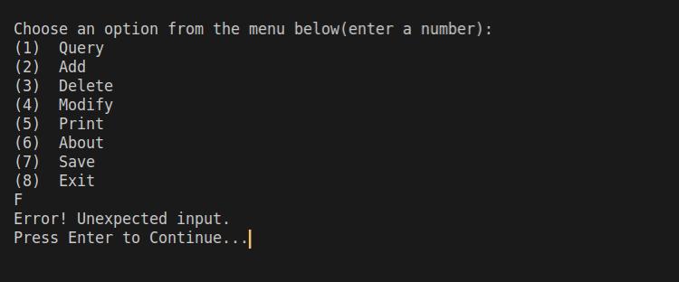

**Error Handling in Menu**

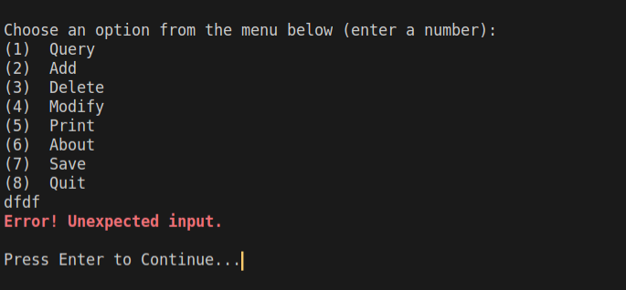

### Load
This functions reads all the contacts from a file and stores them in a global array of type Contact. 
#### Code:
```C
void load()
{
    FILE *f;
    f = fopen(FILENAME, "r");
    if (f == NULL)
    {
        error("Error! Invalid filename\n");
        exit(1);
    }

    while (!feof(f))
    { // %100[^,], Reads at most 100 character or until a comma is encountered
        fscanf(f, "%99[^,],", contacts[Count].lastName);
        fscanf(f, "%99[^,],", contacts[Count].firstName);
        fscanf(f, "%2d-%2d-%4d,",
               &contacts[Count].date.day,
               &contacts[Count].date.month,
               &contacts[Count].date.year);
        fscanf(f, "%99[^,],", contacts[Count].address);
        fscanf(f, "%15[^,],", contacts[Count].number);
        fscanf(f, "%99s\n", contacts[Count].email);
        Count++;
    }
    fclose(f);
}
```

### Query
This function asks the user for last name of the contact(s) he/she is searching for and prints all matching results. It uses a function called [`printOneContact()`](#printOneContact) to print the contact(s) found.
> Note: You can click on the function name to reference its details.
#### Code:
```C
void query()
{
    bool found = false;
    char searchTerm[MAXSTRING];
    printf("Enter the last name of the person: ");
    scanf("%s", searchTerm);

    for (i = 0; i < Count; i++)
    {
        if (strcmp(searchTerm, contacts[i].lastName) == 0)
        {
            printOneContact(contacts, i);
            found = true;
        }
    }
    if (!found)
        error("Person not found!\n");
    
}
```
#### Sample Run:
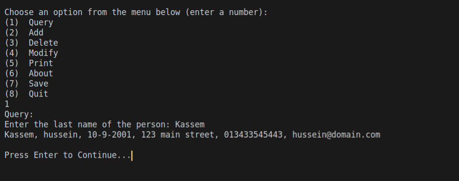
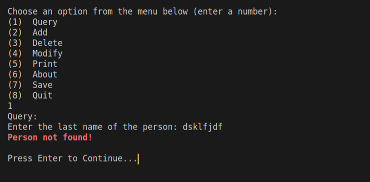

### Add
This Function adds a contact to the phone book. It asks the user for the last name, first name, date of birth formatted as (dd-mm-yyyy), address, phone number, and email address of that new contact. When the contact is added successfully it asks the user if he wants to add another one.If yes, the fuction will call itself.
It validates the user input. It keeps asking the user if he enters invalid input. It uses for that three helping functions  [`validDate()`](#validdate), [`validEmail()`](#validemail), and [`validPhone()`](#validphone). 

> Note: You can click on any of the helping functions for more information.
#### Code:
```C
void add()
{
    char input[10];       // Stores input from the user
    char date[MAXSTRING]; // Stores the date tmp until it is valid
    printf("Enter Last Name: ");
    scanf("%99s", contacts[Count].lastName);
    printf("Enter First Name: ");
    scanf("%99s", contacts[Count].firstName);
    printf("Enter address: ");
    fgets(contacts[Count].address, MAXSTRING, stdin);
    scanf("%99[^\n]%*c", contacts[Count].address);
    do
    {
        printf("Enter Birth Day (dd-mm-yyyy): ");
        scanf("%99s", date);

    } while (!validDate(date, Count));

    do
    {
        printf("Enter phone number: ");
        scanf("%99s", contacts[Count].number);
    } while (!validPhone(contacts[Count].number));

    do
    {
        printf("Enter email: ");
        scanf("%100s", contacts[Count].email);
    } while (!validEmail(contacts[Count].email));

    Count++;

    success("\nContact added successfully.");

    printf("\nDo you want to add another one? (y/n) ");
    scanf("%s", input);

    if (strcmp(input, "y") != 0 && strcmp(input, "n") != 0)
        error("\nError! Unexpected input \n");

    if (strcmp(input, "y") == 0)
        add();
}
```
#### Sample Runs:

**Handing various errors**

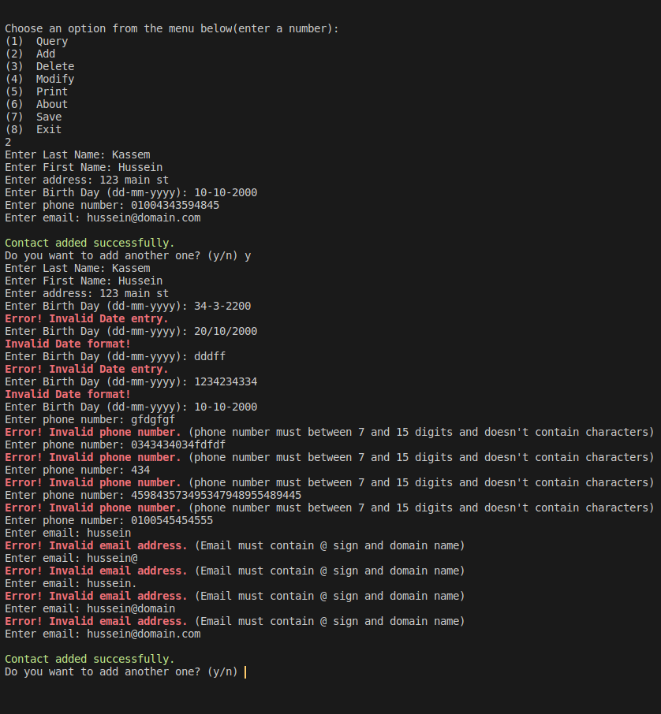

### Delete
This function asks the user for the last and first name of the contact he wants to delete and delete all matching contacts. It achieves that by copying all the contacts that won't be deleted into a new array of contacts and updates the main global array of contacts and the global count for contacts.
In addition, it prints deleted contact(s) so the user can get good indication that the contact is deleted. It gets help from [`printContacts()`](#printContacts) function which prints all the contacts in the array. Also it gives error if the contact is not found.
> Note: You can click on the function name to reference it.
#### Code:
```C
void deleteContact()
{
    char lastName[MAXSTRING];
    char firstName[MAXSTRING];

    Contact newContacts[Count];
    Contact deletedContacts[Count];
    int deletedCount = 0;
    int newCount = 0;
    printf("Enter the last name of the contact you want to delete: ");
    scanf("%s", lastName);
    printf("Enter the first name of the contact you want to delete: ");
    scanf("%s", firstName);

    // copies all contacts into new array
    for (i = 0; i < Count; i++)
    {
        if (strcmp(contacts[i].lastName, lastName) ||
            strcmp(contacts[i].firstName, firstName))
        {
            newContacts[newCount] = contacts[i];
            newCount++;
        }
        else
        {
            deletedContacts[deletedCount] = contacts[i];
            deletedCount++;
        }
    }

    if (newCount != Count)
    {
        for (i = 0; i < Count; i++)
            contacts[i] = newContacts[i];
        Count = newCount;

        printf("\nDeleted Contacts: ");
        printContacts(deletedContacts, deletedCount);
        success("Contacts deleted successfully.\n");
    }
    else
        error("\nError! contact not found.");
}
```
#### Sample Runs:

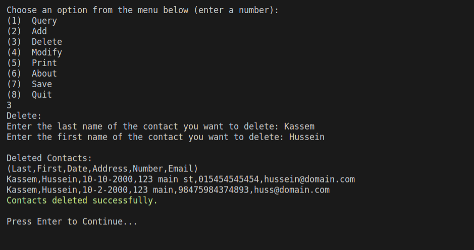

In case of the contact not found:

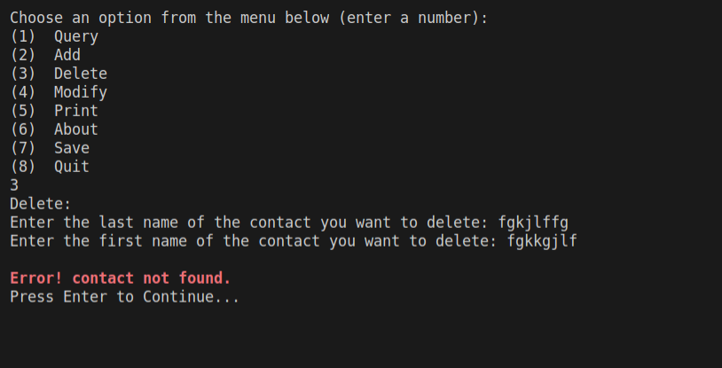

### Modify
This function asks the user for the last name of the contact he/she wants to modify and searches for it. It achieves that by looping through all contacts and saving the indices of matching contacts in an array of type integer. If the number of items in the array is one, it calls [`modifyContact()`](#modifyContact) and lets the user modify the contact directly plus prints that contact's new information. But if the number of items in the array is more than one, a menu having all the contacts that matched last name will be displayed and the user can choose the contact to be modified. Then the user will be asked to enter the number corressponding to the contact he/she wants to modify from that menu. If a contact is successfully specidied, the [`modifyContact()`](#modifyContact) function will be called. [`modifyContact()`](#modifyContact) is very similar to add function but with slight change so it can make it easier to modify contacts and display success messages. If no contact is specified, **item not found** message if displayed and the function ends and no contact is modified.

#### Code:
```C
void modify()
{
    int items[MAXCONTACTS];
    int itemsCount = 0; // Stores index
    char lastName[MAXSTRING];
    char input[10];

    printf("Enter the last name of the person: ");
    scanf("%99s", lastName);

    for (i = 0; i < Count; i++)
    {
        if (strcmp(lastName, contacts[i].lastName) == 0)
        {
            items[itemsCount] = i;
            itemsCount++;
        }
    }

    // handles input from the user and modifies the contact
    if (itemsCount == 1)
        modifyContact(items[0]);
    else if (itemsCount > 1)
    {
        printf("\nChoose an item to delete (Enter a number):\n");
        for (i = 0; i < itemsCount; i++)
            printf("(%d) %s,%s,%d-%d-%d,%s,%s,%s\n",
                   (i + 1),
                   contacts[items[i]].lastName,
                   contacts[items[i]].firstName,
                   contacts[items[i]].date.day,
                   contacts[items[i]].date.month,
                   contacts[items[i]].date.year,
                   contacts[items[i]].address,
                   contacts[items[i]].number,
                   contacts[items[i]].email);

        scanf("%s", input);

        int num = atoi(input);

        if (num == 0 || num > itemsCount + 1)
        {
            printf("Error! Unexpected input. ");
            pause();
        }
        // handles input from the user and modifies the contact
        modifyContact(items[num - 1]);
    }
    else
        error("Error! Item not found.\n");
}
```
#### Sample Runs:

In case of one result:

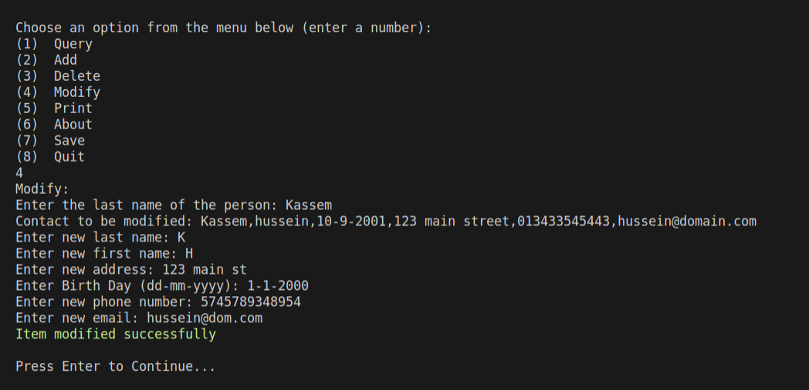

In case of multiple results:

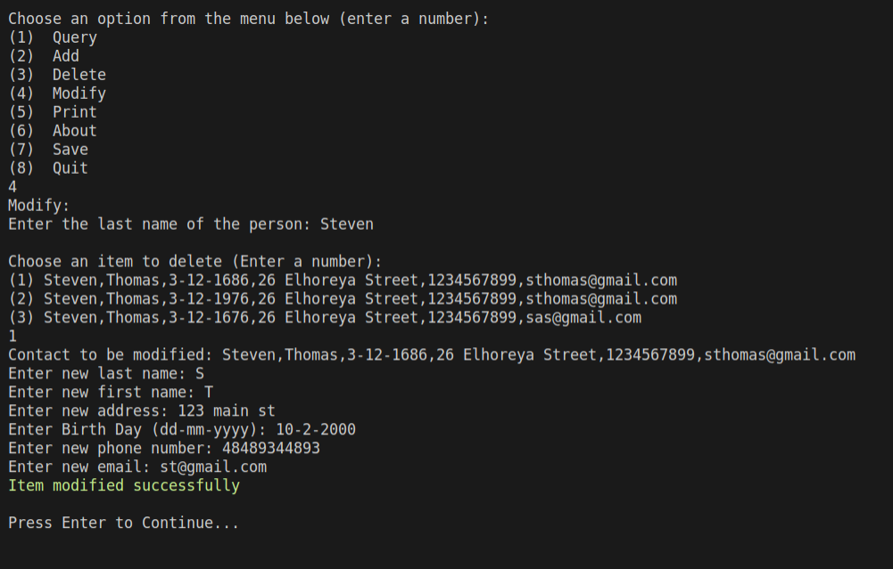

In case that contact not found:

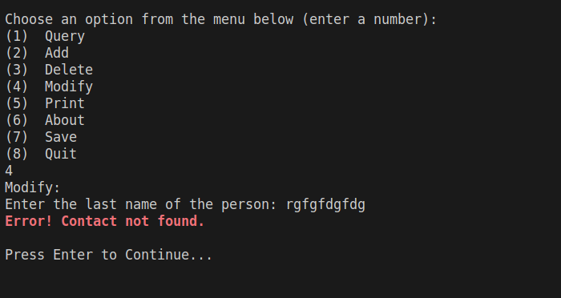

### Print
It prints a menu where the user can choose from printing contacts normally, sorted by last name, or sorted by date of birth. It validates user input.
It achieves that by defining a 2d array which holds menu items so we can easily loop through them. Then according to the user input it calls the appropriate helping function. [`printContaxts()`](#printcontacts), [`sortByLastName()`](#sort-by-last-name) or [`sortByDate()`](#sort-by-date)
> Note: You can click on the function name to reference it.

#### Code:

```C
void printMenu()
{
    char input[10];
    char menuItems[3][MAXSTRING] = {"Normal", "Sort by last name.", "Sort by date of birth."};
    int menuSize = sizeof(menuItems) / sizeof(menuItems[0]);

    printf("\nChoose the number of your option:\n");
    for (i = 0; i < menuSize; i++)
        printf("(%d)  %s\n", (i + 1), menuItems[i]);
    scanf("%s", input);

    switch (atoi(input))
    {
    case 1:
        printContacts(contacts);
        break;
    case 2:
        sortByLastName();
        break;
    case 3:
        sortByDate();
        break;

    default:
        printf("\nError! Unexpected input. \n");
        pause();
        printMenu();
        break;
    }
}
```
#### Sample Run:
**Normal**

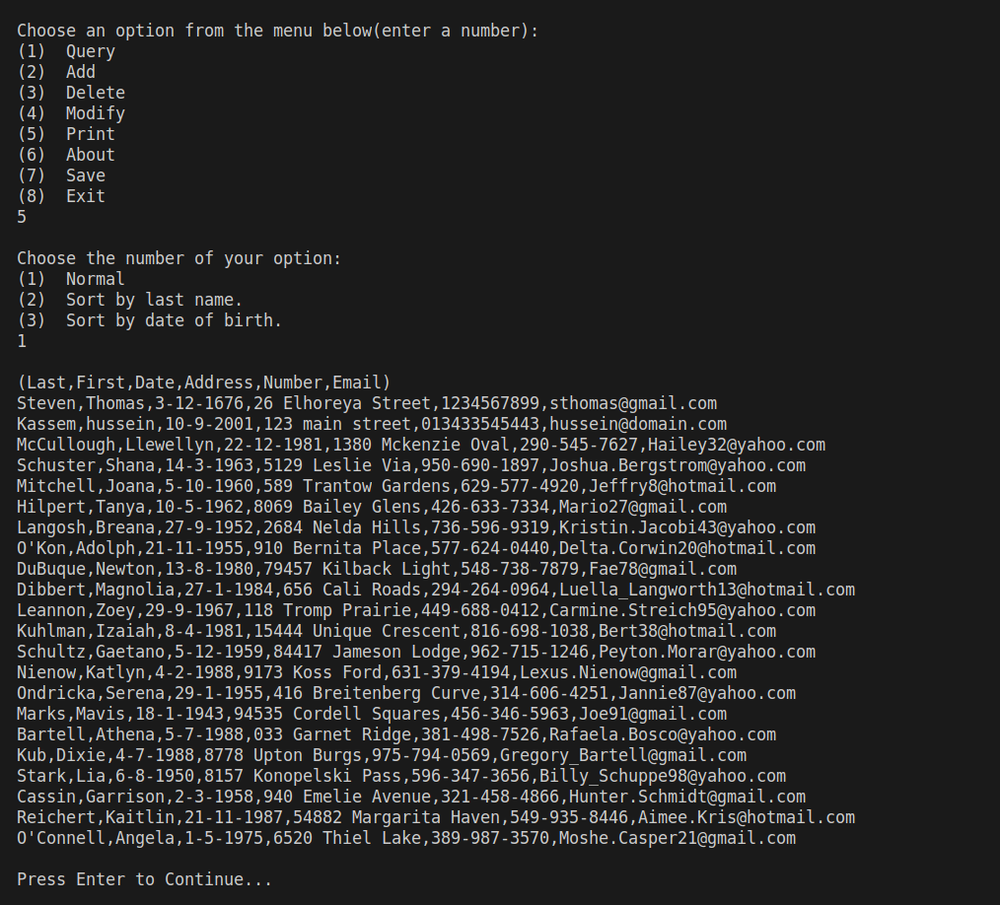

**Sorted by Last Name**

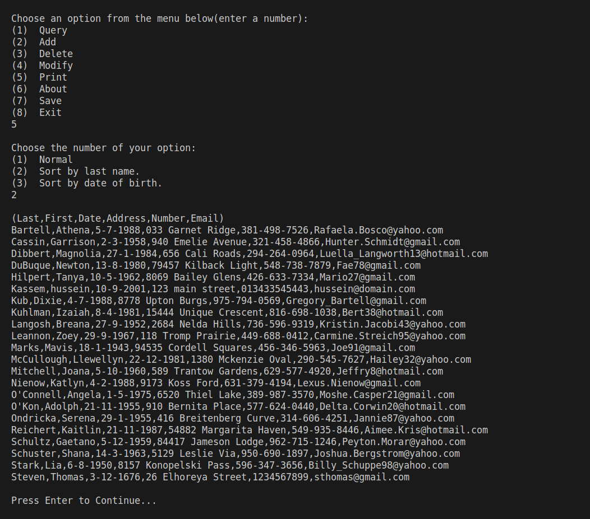

**Sorted by Date of Birth**

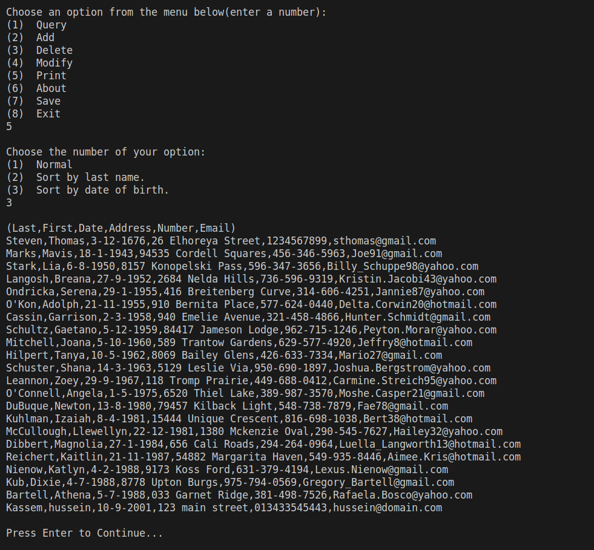

**Error Handling**

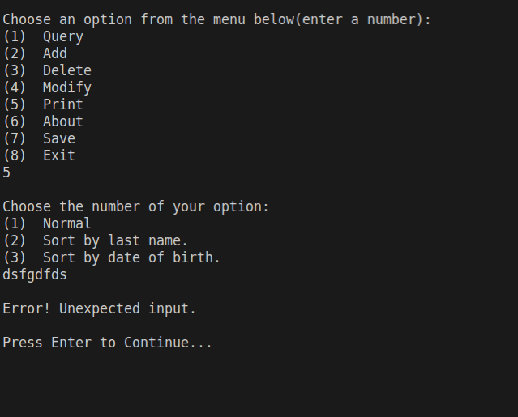


### Save
This function saves all the information of all the contacts in a file. It achieves that by writing all what is inside the global array of Contacts into the same file used in `load()` function.
#### Code:
```C
void save()
{
    FILE *f;
    f = fopen(FILENAME, "w");
    for (i = 0; i < Count; i++)
    {
        fprintf(f, "%s,%s,%d-%d-%d,%s,%s,%s\n",
                contacts[i].lastName,
                contacts[i].firstName,
                contacts[i].date.day,
                contacts[i].date.month,
                contacts[i].date.year,
                contacts[i].address,
                contacts[i].number,
                contacts[i].email);
    }
    fclose(f);
    success("\nContacts saved successfully");
}
```

### Quit 
This function simply allows the user to quit from the program if he/she wants. It first displays a warning message if any modification is done on the global array of Contacts and that modification isn’t saved. If that modification is saved before entering the Quit() function, then no warning message will be displayed. If no modification occurred at all, then again no warning message will be displayed.It achieves that by reading all the contents of the file into an array of contacts and compares its count to the global one. If they aren't the same then the user definitely has unsaved changes. If their count is the same then it checks the two arrays element by element. If it founds a difference then the user modified a contact so it also displays a warning message.
Then the user is asked “Are you sure you want to quit(y/n)?”. The function keeps asking the user to enter a valid input if the input isn’t “y” or “n”. If “y”, the program ends. If “n”, the program will return to `menu()` function.

#### Code:
```C
void quit()
{
    FILE *f;
    Contact tmpContacts[MAXCONTACTS];
    int tmpCount = 0;
    char input[10];
    bool flag = false;

    f = fopen(FILENAME, "r");

    while (!feof(f))
    { // %100[^,], Reads at most 100 character or until a comma is encountered
        fscanf(f, "%99[^,],", tmpContacts[tmpCount].lastName);
        fscanf(f, "%99[^,],", tmpContacts[tmpCount].firstName);
        fscanf(f, "%2d-%2d-%4d,",
               &tmpContacts[tmpCount].date.day,
               &tmpContacts[tmpCount].date.month,
               &tmpContacts[tmpCount].date.year);
        fscanf(f, "%99[^,],", tmpContacts[tmpCount].address);
        fscanf(f, "%15[^,],", tmpContacts[tmpCount].number);
        fscanf(f, "%99s\n", tmpContacts[tmpCount].email);
        tmpCount++;
    }
    fclose(f);

    if (tmpCount != Count)
        error("Warning: You have unsaved data that will be lost.\n");

    else if (tmpCount == Count)
    {
        for (i = 0; i < Count; i++)
        {
            // Compares contacts
            if (strcmp(contacts[i].firstName, tmpContacts[i].firstName) ||
                strcmp(contacts[i].lastName, tmpContacts[i].lastName) ||
                contacts[i].date.day != tmpContacts[i].date.day ||
                contacts[i].date.month != tmpContacts[i].date.month ||
                contacts[i].date.year != tmpContacts[i].date.year ||
                strcmp(contacts[i].address, tmpContacts[i].address) ||
                strcmp(contacts[i].number, tmpContacts[i].number) ||
                strcmp(contacts[i].email, tmpContacts[i].email))
            {
                flag = true;
                break;
            }
        }
        if (flag)
            error("Warning: You have unsaved data that will be lost.\n");
    }

    printf("Are you sure you want to quit? (y/n) ");
    scanf("%s", input);
    if (strcmp(input, "y") && strcmp(input, "n"))
    {
        error("\nError! Unexpected input.\n");
        pause();
    }

    if (strcmp(input, "y") == 0)
        exit(0);
}
```

#### Sample Runs:
In Case of no changes are made:
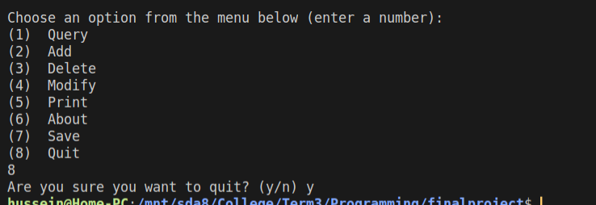

In Case of changes:

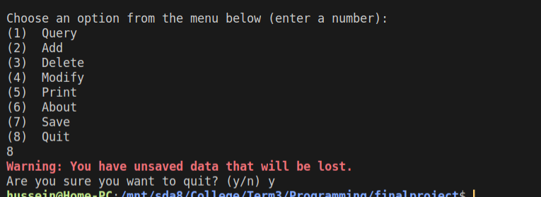


In Case of invalid input

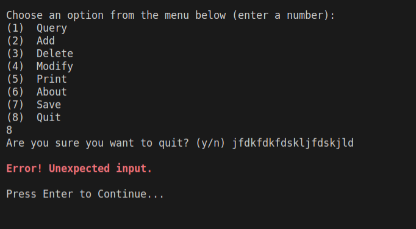

### Sort by last name

This function sorts the global array of Contacts by last name with the help of the built-in function `qsort()`. `qsort()` itself needs a helping function. So, [`compareNames()`](#comparenames) function is that helping function.  
The role of [`compareNames()`](#comparenames) function is to compare two items and return an integer value less than zero if the first item is less than second item , return zero if both items are equal, or return an integer value more than zero if the first item is greater than second item.
> You can find sample runs for this function in [Print](#print-1) section above
> Note: You can click on the name of the helping functions for more information.
#### Code:
```C
int compareNames(const void *pa, const void *pb)
{
    const Contact *p1 = pa;
    const Contact *p2 = pb;
    return strcmp(p1->lastName, p2->lastName);
}

void sortByLastName()
{
    qsort(contacts, Count, sizeof(Contact), compareNames);
    printContacts(contacts, Count);
}
```

### Sort by date
This function sorts the global array of contacts by date of birth. It uses bubble sort to sort the array but it relies on a function [`compareDates()`](#comparedates) to compare dates. 

The way it works is by taking to dates it returns true if the first date is later than the second one else it returns false. It compares the two years if they doesn't match then it returns true. If the year matches and months don't then it returns true. Finally if the year and month are the same and day don't match then it returns true else it returns false as the second date is smaller than or equal the first.

> You can find sample runs for this function in [Print](#print-1) section above
> Note: You can click on the name of the helping functions for more information.
#### Code:
```C
bool compareDates(BirthDate date1, BirthDate date2)
{
    // All cases when true should be returned
    if (date1.year > date2.year)
        return true;
    if (date1.year == date2.year && date1.month > date2.month)
        return true;
    if (date1.year == date2.year && date1.month == date2.month &&
        date1.day > date2.day)
        return true;
    // If none of the above cases satisfy, return false
    return false;
}

void sortByDate()
{
    for (i = 0; i < Count - 1; i++)
    {
        // Last i elements are already in place
        for (j = 0; j < Count - i - 1; j++)
        {
            if (compareDates(contacts[j].date, contacts[j + 1].date))
            {
                Contact temp;
                temp = contacts[j];
                contacts[j] = contacts[j + 1];
                contacts[j + 1] = temp;
            }
        }
    }
    printContacts(contacts, Count);
}

```
### Utility functions:
#### error
It prints red colored text which is used in printing error messages.
##### Code:
```C
void error(char message[])
{
    printf("\033[1;31m%s\033[0m", message);
}
```
##### Sample Run:


#### success
It prints green colored text which is used in printing success messages.

##### Code:
```C
void success(char message[])
{
    printf("\033[0;32m%s\033[0m", message);
}
```

#### pause
This function asks the user for input. It is used after showing outputs to pause the program so the user can have time to read the output. If not used, the user won't be able to read the changes he/she made since the `menu()` function will clear the screen immediately.
##### Code:
```C
void pause()
{
    getchar();
    printf("\nPress Enter to Continue...");
    getchar();
}
```

#### getCurrentYear
This function returns the current year which helps in validating date input.
##### Code:
```C
int getCurrentYear()
{
    time_t s;
    struct tm *currentTime;
    int CURRENTYEAR;
    s = time(NULL);
    currentTime = localtime(&s);
    CURRENTYEAR = currentTime->tm_year + 1900;
    return CURRENTYEAR;
}
```

#### printContacts
This function prints all the elements of an array of type Contact. The integer **size** specifies the number of elements of that array to be printed.
##### Code:
```C
void printContacts(Contact arr[], int size)
{
    printf("\n(Last,First,Date,Address,Number,Email)\n");

    for (i = 0; i < size; i++)
    {
        printf("%s,%s,%d-%d-%d,%s,%s,%s\n",
               arr[i].lastName,
               arr[i].firstName,
               arr[i].date.day,
               arr[i].date.month,
               arr[i].date.year,
               arr[i].address,
               arr[i].number,
               arr[i].email);
    }
}
```

#### printOneContact
This function prints an element of an array of type Contact. The integer **index** specifies that element.
##### Code:
```C
void printOneContact(Contact arr[], int index)
{
    printf("%s,%s,%d-%d-%d,%s,%s,%s\n",
           arr[index].lastName,
           arr[index].firstName,
           arr[index].date.day,
           arr[index].date.month,
           arr[index].date.year,
           arr[index].address,
           arr[index].number,
           arr[index].email);
}
```

#### modifyContact
This function modifies all the information of an existing contact. The new date of birth, phone, and email will be validated using the [`validDate()`](#validdate), [`validPhone()`](#validphone), and [`validEmail()`](#validemail) respectively.

##### Code:
```C
void modifyContact(int index)
{
    char date[MAXSTRING];
    printf("Contact to be modified: ");
    printOneContact(contacts, index);
    printf("Enter new last name: ");
    scanf("%99s", contacts[index].lastName);
    printf("Enter new first name: ");
    scanf("%99s", contacts[index].firstName);
    printf("Enter new address: ");
    fgets(contacts[index].address, MAXSTRING, stdin);
    scanf("%99[^\n]%*c", contacts[index].address);

    do
    {
        printf("Enter Birth Day (dd-mm-yyyy): ");
        scanf("%99s", date);
    } while (!validDate(date, index));

    do
    {
        printf("Enter new phone number: ");
        scanf("%99s", contacts[index].number);
    } while (!validPhone(contacts[index].number));

    do
    {
        printf("Enter new email: ");
        scanf("%99s", contacts[index].email);

    } while (!validEmail(contacts[index].email));
    success("Item modified successfully\n");
}
```

#### validDate
This function validates the date. First it checks that the day is from 1 to 31, month is from 1 to 12, and year is from 1900 to current year. If no, it stops immediately and an **invalid date** message is displayed and the function returns **false**. If yes, it continues and checks all the cases for which the date is invalid.Examples of invalid dates are 29-2-2001, 30-2-2000, 31-4-2001, and 31-5-2111. If the entered date matched any of those cases for which the date is invalid, then the checking stops immediately and an **invalid date** message is displayed and the function returns **false**. However, if the entered date didn't match any of those cases then the date is valid and is stored successfully and the function returns **true**.
##### Code:
```C
bool validDate(char date[], int count)
{
    long int dateLength = strlen(date); // stores the length of date
    int dashCount = 0;
    char *token;
    int day, month, year;

    if (dateLength < 8 || dateLength > 10)
    {
        error("Error! Invalid Date entry.\n");
        return false;
    }
    for (i = 0; i < dateLength; i++)
    {
        if (date[i] == '-')
            dashCount++;
    }

    if (dashCount != 2)
    {
        error("Invalid Date format!\n");
        return false;
    }

    token = strtok(date, "-");
    day = atoi(token);
    // Converts date as string to day, month , year as int
    for (i = 0; i <= 3; i++)
    {
        if (i == 1)
            month = atoi(token);
        else if (i == 2)
            year = atoi(token);
        token = strtok(NULL, "-");
    }

    if (day > 0 && day <= 31 && month > 0 && month <= 12 && year <= getCurrentYear() && year >= 1900)
    {
        // handles feb
        if (month == 2)
        {
            if (day > 29)
            {
                error("Error! Invalid Date entry.\n");
                return false;
            }
            else if (day == 29)
            {
                if (year % 4 != 0)
                {
                    error("Error! Invalid Date entry.\n");
                    return false;
                }
            }
        }
        //handle months which has only 30 days
        else if ((month == 4 || month == 6 ||
                  month == 9 || month == 11) &&
                 (day > 30))
        {
            error("Error! Invalid Date entry.\n");
            return false;
        }
    }
    else
    {
        error("Error! Invalid Date entry.\n");
        return false;
    }

    contacts[count].date.day = day;
    contacts[count].date.month = month;
    contacts[count].date.year = year;

    return true;
}
```

#### validPhone
This function validates the entered phone number. The entered number must be from 7 to 15 character and all these characters must be integers from 0 to 9. If not, an **invalid phone number** message is displayed and the function returns **false**. Else, the number is succeefully stored and the function returns **true**.
##### Code:
```C
bool validPhone(char num[])
{

    for (i = 0; i < strlen(num); i++)
    {
        if (!isdigit(num[i]) || strlen(num) < 7 || strlen(num) > 15)
        {
            error("Error! Invalid phone number.");
            printf(" (phone number must between 7 and 15 digits and doesn't contain characters)\n");
            return false;
        }
    }
    return true;
}
```

#### validEmail
This function validates the entered email. The entered email must be on the form **name@domain.com**. If not, an **invalid email** message is displayed and the function returns **false**. Else, the email is successfully stored and the function returns **true**.

##### Code:
```C
bool validEmail(char email[])
{
    int emailLength = strlen(email);
    for (i = 0; i <= emailLength; i++)
    {
        if (i != 0 && email[i] == '@' && i != emailLength - 1)
        {
            for (j = i; j <= emailLength; j++)
            {
                if (j != i && email[j] == '.' && j != emailLength - 1)
                    return true;
            }
        }
    }

    error("Error! Invalid email address.");
    printf(" (Email must contain @ sign and domain name)\n");
    return false;
}
```

#### compareNames
This function is the helping function of the built-in qsort() function that is used in [`sortByLastName()`](#sort-by-last-name) function. It compares two names and returns an integer value less than zero if the first name is less than second name, returns zero if both names are equal, or returns an integer value more than zero if the first name is greater than second name.

##### Code:
```C
int compareNames(const void *pa, const void *pb)
{
    const Contact *p1 = pa;
    const Contact *p2 = pb;
    return strcmp(p1->lastName, p2->lastName);
}
```

#### compareDates
This function is used in [`sortByDate()`](#sort-by-date). It compares two dates and determines which date is before the other. It returns **true** if the second date is before the first date, or returns **false** if both dates are equal or if the second date is after the first date.
##### Code:
```C
bool compareDates(BirthDate date1, BirthDate date2)
{
    // All cases when true should be returned
    if (date1.year > date2.year)
        return true;
    if (date1.year == date2.year && date1.month > date2.month)
        return true;
    if (date1.year == date2.year && date1.month == date2.month &&
        date1.day > date2.day)
        return true;
    // If none of the above cases satisfy, return false
    return false;
}
```
